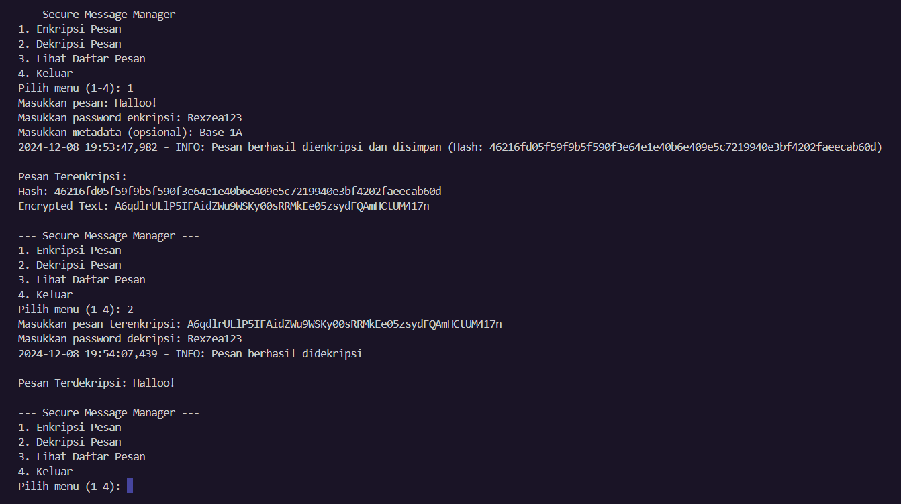
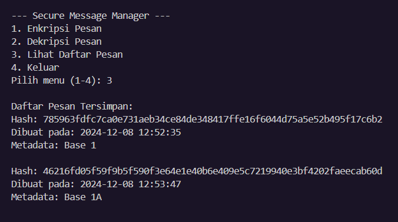
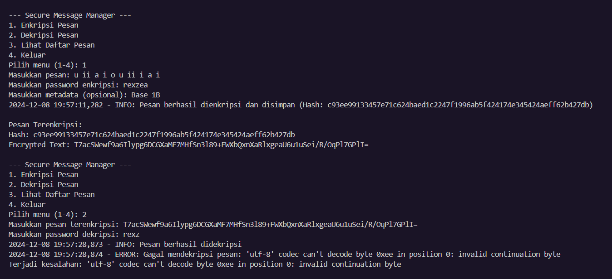
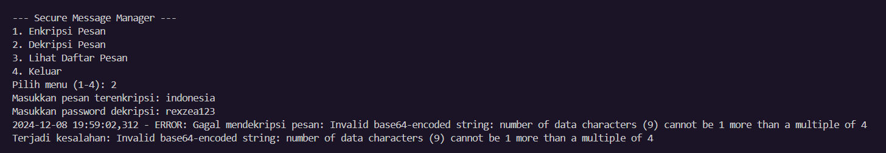

# 🔐 AES Text Encryptor

**AES Text Encryptor** adalah sebuah aplikasi Python yang memungkinkan kamu mengenkripsi dan mendekripsi pesan teks menggunakan algoritma **AES (Advanced Encryption Standard)**. Dengan fitur penyimpanan terenkripsi di database SQLite, kamu dapat mengelola pesan dengan aman dan efisien! 🚀

### ✨ Fitur Utama
- 🔑 **Enkripsi Pesan**: Mengenkripsi pesan teks dengan kata sandi menggunakan algoritma AES.
- 🔓 **Dekripsi Pesan**: Mendekripsi pesan terenkripsi dengan kata sandi yang benar.
- 🗂️ **Penyimpanan Database**: Pesan terenkripsi disimpan di SQLite dengan metadata untuk referensi.
- 🕵️‍♂️ **Keamanan Kunci**: Kunci enkripsi dihasilkan menggunakan PBKDF2 untuk keamanan tambahan.
- 📜 **Log Aktivitas**: Aktivitas aplikasi dicatat secara otomatis dalam file log untuk pemantauan.

### 📦 Instalasi
1. Clone repository ini:
   ```bash
   git clone https://github.com/rexzea/AES-Text-Encryptor.git
   ```


2. Buat virtual environment (opsional tetapi direkomendasikan):
   ```bash
   python -m venv myenv
   source myenv/bin/activate  # Untuk Linux/MacOS
   myenv\Scripts\activate     # Untuk Windows
   ```

**Akses Khusus**
```bash
   cd AES-Text-Encryptor
```

## 🚀 Cara Menggunakan
### 1. Jalankan program:
```bash
python AES.py
```
### 2. Pilih salah satu menu:
  - 1: Enkripsi pesan baru.
  - 2: Dekripsi pesan yang sudah terenkripsi.
  - 3: Lihat daftar pesan yang tersimpan.
  - 4: Keluar dari aplikasi.

## 🛠️ Teknologi yang Digunakan
Python 3.10+
- Cryptography: Untuk enkripsi dan dekripsi pesan.
- SQLite: Sebagai penyimpanan database lokal.
- Logging: Untuk mencatat aktivitas aplikasi.

 ## 📷 Review
  ### Review Penggunaan
  

  ### Daftar Pesan
  

  ### Error Jika Password Salah
   

  ### Tidak Dapat Mendeskripsikan Enkripsi Sebelum Membuat Enkripsi
   


## 🤝 Kontribusi
Kontribusi kamu selalu diterima! Kamu bisa membantu dengan:

- Menambahkan fitur baru.
- Memperbaiki bug.
- Meningkatkan dokumentasi.


## 📝 Lisensi
cr : Rexzea

## 📧 Kontak
Jika ada pertanyaan atau saran, jangan ragu untuk menghubungiku di:
- futzfary@gmail.com
- 08988610455
